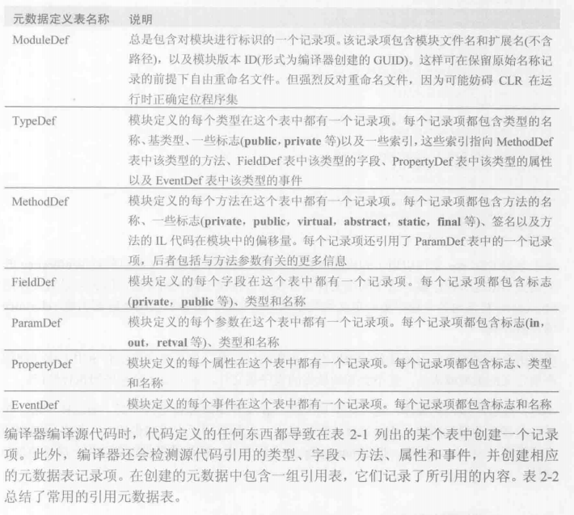
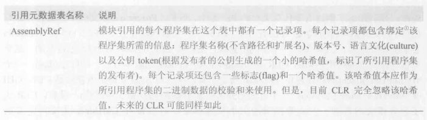
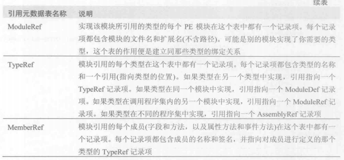
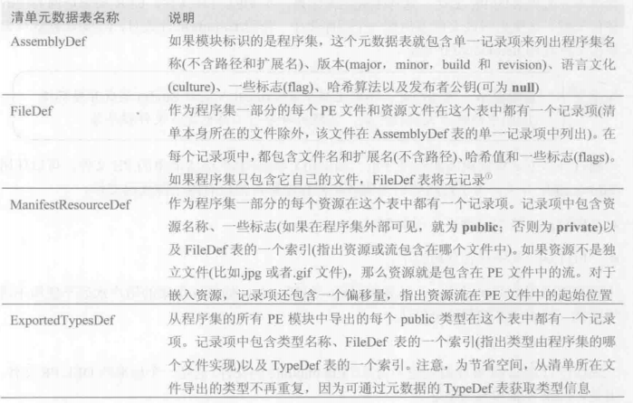

#### 1. 将类型生成到模块中
MSCorLib.dll程序集包含了所有核心类型，包括Byte,Char,String,Int32等等,C#编译器会自动引用该程序集

#### 2. exe文件
标准PE(可移植执行体，Portable Executable)文件
Windows支持三种应用程序
1. 控制台用户界面(Console User Interface, CUI)   /t:exe开关
2. 图形用户界面(Graphical User Interface, GUI)   /t:winexe开关
3. Windows Store应用 /t:appcontainerexe开关

**响应文件**
响应文件是包含一组编译器命令行开关的文本文件。执行CSC.exe时，编译器打开响应文件，并使用其中包含所有的开关，就像是这些开关直接在命令行上传递给CSC.exe。
例如,假定响应文件MyProject.rsp包含以下文本:
/out:MyProject.exe
/target:winexe
为了让CSC.exe使用这些设置，可以像下面这样调用它:
csc.exe @MyProject.rsp CodeFile1.cs CodeFile2.cs
告诉了C#编译器输出文件的名称和要创建哪种类型的应用程序。响应文件使我们不必每次编译项目时都手动置顶命令行参数。
C#编译器支持多个响应文件。除了在命令行上显式指定的文件，还会自动查找名为CSV.rsp的文件。CSC.exe运行时，会在CSC.exe锁在的目录查找全局CSC.rsp文件。**优先本地设置，命令行上显式设置也会覆盖本地响应文件中的设置**

全局CSV.rsp文件引用了很多程序集，简化操作

#### 3. 元数据
PE文件构成
**1. PE32(+)头** (Windows要求的标准信息)
**2. CLR头** 一个小的信息快，需要CLR的模块(托管模块)特有的。CLR的major、minor版本号;一些标志(flag);一个MethodDef token(该token制定了模块的入口方法，前提是CUI,GUI或Windows Store执行体);还包含一些模块内部的一些元数据表的大小和偏移量
**3. 元数据** 由几个表构成的二进制数据块
   
   1. 定义表(definition table)
   
   2. 引用表(reference table)
   
   
   3. 清单表(manifest table)

还有许多其他的定义表和引用表。
**4. IL**

可用多种工具检查托管PE文件中的元数据。比如ILDasm.exe
```
ILDasm Program.exe
```

#### 4. 将模块合并成程序集
程序集时一个或多个类型定义文件及资源文件的集合。在程序集中的所有文件中有一个文件容纳了**清单(manifest)**。清单也是一个元数据的集合，表中主要包含了作为程序集组成部分的那些文件的名称。还描述了程序集的版本、语言文化、发布者、公开导出的类型以及构成程序集的所有文件。
CLR操作的是程序集。CLR会首先加载清单中的文件，再根据清单来获取程序集中的其他文件的名称
下面列出了程序集的重要特点
1. 程序集定义了可重用的类型
2. 程序集用一个版本号标记
3.  程序集可以关联安全信息
除了包含清单元数据表的文件，程序集其他单独的文件并不包含上述特点。
类型为了顺利的打包、版本控制、安全保护以及使用，必须放在座位程序集的一部分的模块中。
程序集清单

