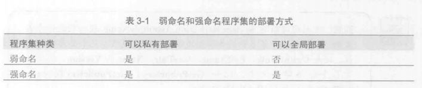
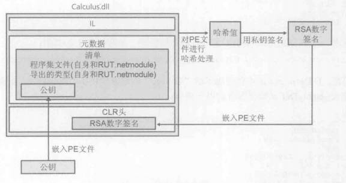
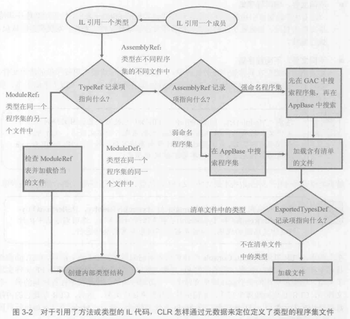

#### 1.两种程序集，两种部署
CLR支持两种程序集:弱命名程序集、强命名程序集
他们结构完全相同。唯一不同的是强命名程序集使用发布者的公钥/私钥进行了签名。

程序集可采用两种方式部署:私有或全局
1. 私有 部署到应用程序基目录或者某个子目录的程序集
2. 全局 部署到一些公认位置的程序集



#### 2.为程序集分配强名称
强命名程序集有4个重要特性，他们共同对程序集进行了唯一性标识:
1. 文件名（不计扩展名）
2. 版本号
3. 语言文化
4. 公钥（由于公钥数字很大，所以经常使用从公钥派生的小哈希值）

以下标记了4个完全不同的程序集文件
```
"MyType, Version=1.0.0.8123.0, Culture=neutral, PublicKeyToken=b77a5c561934e089"
"MyType, Version=1.0.0.8123.0, Culture="en-US", PublicKeyToken=b77a5c561934e089"
"MyType, Version=2.0.0.8123.0, Culture=neutral, PublicKeyToken=b77a5c561934e089"
"MyType, Version=1.0.0.8123.0, Culture=neutral, PublicKeyToken=b03f5as123512sbs"
```

第一个标识的是程序集文件MyType.exe或MyType.dll(无法根据程序集标识字符串判断文件扩展名)。可通过辅助类System.Reflection.AssemblyName获取程序集名称。

生成包含清单的PE文件后，会对PE文件的完整内容（出去Authenticode Signature、程序集强名称数据以及PE头校验和）进行哈希处理。哈希值用发布者的私钥进行签名，得到RSA数字签名存储到PE文件的一个保留区域（进行哈希处理时，会忽略这个区域）。PE文件的CLR头进行更新，反映数字签名在文件中的嵌入位置。


发布者公钥也嵌入PE文件的AssemblyDef清单元数据表。文件名、程序集版本号、语言文化和公钥的组合为这个程序集赋予了一个强名称，它保证是唯一的。

#### 3. 全局程序集缓存
由多个应用程序访问的程序集必须放到公认的目录，而CLR在检测到对改程序的引用时，必须知道检查该目录。这个公认位置就是全局程序及缓存(Global Assembly Cache, GAC)。一般在以下目录发现它:
```
%SystemRoot%\Microsoft.NET\Assembly
```
GAC目录是结构化的:其中包含许多子目录，子目录名称用算法生成。永远不要手动复制程序集到GAC目录。
不能将弱命名程序集放到GAC。

#### 4. 在生成的程序集中引用强命名程序集
如果编译器开关指定想引用的程序集文件名。如果文件名是完整路径，CSC.exe会加载指定文件，并根据它的元数据生成程序集。如果不包含路径的文件名，CSC.exe会尝试在以下目录查找程序集
1. 工作目录
2. CSC.exe所在的目录，目录还包括CLR的各种DLL文件
3. 使用/lib编译器开关指定的任何目录
4. 使用LIB环境变量指定的任何目录

安装.NET Framework时，实际会安装Microsoft的程序集文件的两套拷贝。一套安装到编译器/CLR目录，一套安装到GAC的子目录。一个方便生成一个方便运行时加载。

CSC.exe编译器不在GAC中查找引用的程序集，是因为你必须知道程序集路径，而GAC的目录没正式公开。

#### 5. 延迟签名
开发时用公钥签名(无法实现防篡改保护)。打包和部署程序集再签名。

#### 6. 私有部署强命名程序集
在GAC中安装程序集有几方面的优势。GAC使程序集能被多个应用程序共享，减少了总体物理内存消耗。

#### 7. "运行时"如何解析类型引用
```
public sealed class Program {
   public static void Main() {
      System.Console.WriteLine("hi");
   }
}
```
编译这些代码并生成程序集(假定为Program.exe)。运行应用程序，CLR会加载并初始化自身，读取程序集的CLR头，查找标识了应用程序入口方法(Main)的MethodDefToken，检索MethodDef元数据表找到方法的IL代码在文件中的偏移量，将IL代码JIT编译成本机代码，最后执行本机代码。

解析引用的类型时，CLR可能在以下三个地方找到类型
1. 相同文件
   编译时便能发现对相同文件中的类型的访问，这称为**早期绑定**。类型直接从文件中加载，执行继续。
2. 不同文件，相同程序集
   "运行时"确保被引用的文件在当前程序集元数据的FileDef表中，检查加载程序集清单文件的目录，加载被引用的文件，检查哈希值以确保文件完整性。发现类型的成员，执行继续。
3. 不同文件，不同程序集
   如果引用的类型在其他程序集的文件中，"运行时"会加载被引用程序集的清单文件，如果需要的类型不在该文件中，就继续加载包含了类型的文件。发现类型的成员，执行继续。

   
   CLR所以程序集都根据名称、版本、语言文化和公钥来识别。
   GAC根据名称、版本、语言文化、公钥和CPU架构来识别。