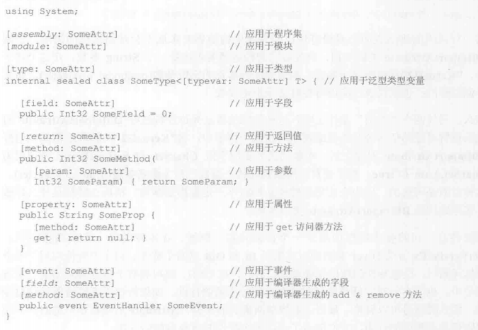
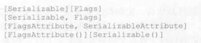

#### 1.定制特性
利用定制特性可以宣告式为自己的代码构造添加注解来实现特殊功能
大部分特性对编译器没有意义，编译器只是检测源代码中的特性并生成对应的元数据
例子
1. DllImport特性应用于方法，告诉CLR该方法的实现位于指定DLL的非托管代码中
2. Serializable特效应用于类型。告诉序列化格式化器一个实例的字段可以序列化和反序列化
3. AssemblyVersion特性应用于程序集，设置程序集的版本号
4. Flag特性应用于枚举类型，枚举类型就成了位标志集合

CLR允许将特性应用于可在文件中表示的几乎任何东西，最常用的如下：
TypeDef（类、结构、枚举、接口和委托）
MethodDef（含构造器）
FieldDef
PropertyDef
EventDef
AssemblyDef
ModuleDef
更具体地说，C#只允许将特性应用于以下任何目标元素的的源代码：
程序集、模块、类型、字段、方法、方法参数、方法返回值、属性、事件和泛型类型参数

应用特性时，C#允许用一个前缀明确指定特性要应用于的目标元素，有时也可以省略前缀
以下是必须的

C#允许省略特性的Attribute后缀以减少打字量,许多源代码都是[DllImport(...)]而不是
[DllImportAttribute(...)]

```
[DllImport("Kernel32", CharSet = CharSet.Auto]
```
DllImportAttribute类构造器接受一个String参数，构造器的参数称为定位参数
这种特殊语法云溪在构造好DllImport对象后设置对象的任何公共字段或属性，用于设置
字段或属性的参数称为命名参数，此参数可选

还可以将多个特性应用于一个目标元素
如果特性不获取参数，可将多个特性整合在一起

