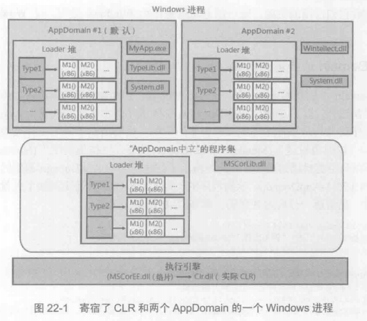
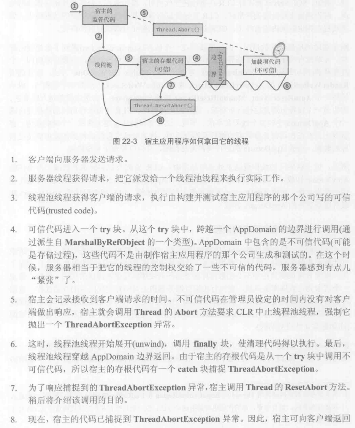

#### 1.CLR寄宿
.NET Framework在windows平台的顶部运行。这意味着.NET Framework必须用Windows能理解的技术来构建。首先，所有托管模块和程序集文件都必须使用Windows PE文件格式，而且要么是Windows EXE文件，要么是DLL文件
开发CLR时，微软实际是把它实现成包含在一个DLL中的COM服务器 为CLR定义了一个标准的COM接口，并为接口和COM服务器分配了GUID，安装.NET Framework时，代表CLR的COM服务器和其他COM服务器一样在Windows注册表中注册。
任何Windows应用程序都能寄宿CLR。但不要通过调用CoCreateInstance来创建CLR COM服务器的实例，相反，非托管宿主应该调用MetaHost.h文件中生命的CLRCreateInstance函数。CLRCreateInstance函数在MSCorEE.dll文件中实现。此DLL一般称为“垫片”（shim）。它的工作是决定创建那个版本的CLR，垫片DLL不包括CLR COM服务器。
一台机器可安装多个版本的CLR，但只有一个版本的MSCorEE.dll文件
CLRCreateInstance函数可返回一个ICLRMetaHost接口。宿主可调用接口的GetRuntime函数指定宿主要创建的CLR版本，然后垫片将所需版本的CLR加载到宿主进程中。
默认一个托管的可执行文件启动时，垫片会检查可执行文件，提取当初生成和测试使用的CLR版本信息。但应用程序可通过它的XML配置文件设置requiredRuntime和supportedRuntime这两项覆盖该默认行为
GetRuntime函数返回指向非托管ICLRRuntimeInfo接口的指针，利用其GetInterface方法获取ICLRRuntimeHost接口。数组可调用该接口定义的方法做以下这些事情
1. 设置宿主管理器。告诉CLR宿主想参与涉及以下操作的决策：内存分配、线程调度、同步、程序及加载等。还可以声明想获得有关垃圾回收启动和停止以及特定操作超时的通知
2. 获取CLR管理器、告诉CLR阻止使用某些类/成员。另外宿主能分辨那些代码可以调试，以及特定时间发生时宿主应调用那个方法（AppDomian卸载、CLR停止、堆栈溢出)
3. 初始化并启动CLR
4. 加载程序集并执行其中的代码
5. 停止CLR，阻止任何更多的托管代码在Windows进程中运行

#### 2.AppDomain
CLR COM服务器初始化时会创建一个AppDomain.AppDomain是一组程序集的逻辑容器，这个默认APPDomain只有进程终止时才会被销毁
AppDomian是为了提供隔离而设计的
1. 一个AppDomain的代码不能直接访问另一个APPDo面的代码创建的对象
2. AppDomain可以卸载
3. AppDomian可以单独保护
4. AppDomain可以单独配置


两个AppDomain的Loader堆会为相同的类型分别分配一个类型对象，类型对象的内存不会由两个AppDomain贡献，方法的IL代码进行JIT编译，生成的本机代码也是单独与每个AppDomain关联的

对于像System.Object，System.Int32以及其他与.NET Framework密不可分的类型(MSCorLib.dll)，CLR初始化时，该程序集会自动加载，所有AppDomain共享该程序集的类型，以“AppDomain中立”的方式加载的程序集，CLR会为他们维护一个特殊的Loader堆，该Loader堆中的所有类型对象，以及生成的所有本机代码都会由进程中的所有AppDomain共享。

#### 3.跨越AppDomain边界访问对象
1. 按引用封送
继承MarshalByRefObject的对象
```
MarshalByRefType mbrt = (MarshalByRefType)domain.CreateInstanceAndUnwrap(exeAssembly, "MarshalByRefType");
```
对引用修改会照实的反应到原对象上；
静态字段是例外，并不会反映到原对象上
由于按引用封送，需要在目标应用程序创建代理，对对象的所有成员的访问都通过代理的缘故，所以执行效率不高，实际继承自MarshalByRefObject的类型，即使在本应用程序实例化的对象对字段的访问效率也比较低
调用线程会从当前AppDomian切换至新AppDomain，任何时候一个线程只能在一个AppDomain中，跨AppDomain边界的方法调用时同步执行的。
2. 按值传递
类必须支持序列化

新创建的AppDomain没有根，所以代理引用的原始对象可以被GC。假定将原始对象不确定的留在内存中，代理可能不再引用它，而原始对象依然存活。CLR的解决方法：“租约管理器"(lease manager)。一个对象的带你创建好之后，CLR保持对象存活5分钟。每次调用都会续订对象的租期，保证接下来的2分钟内在内存中保持存活。可以重写MarshalByRefObject的虚方法InitializeLifeService修改租期

#### 4.AppDomain卸载
```
AppDomain.Unload(domain)
```
销毁时CLR会有以下动作：
1. CLR挂起进程中执行过托管代码的所有线程
2. CLR检查所有线程栈，查看那些线程正在执行要卸载AppDomain的代码或会在某个时候返回至要卸载的AppDomain。任何栈上有卸载的AppDomain，CLR强制对应线程抛出ThreadAbortException（同时恢复线程的执行）。这将导致线程展开（unwind），并执行遇到的所有finally块以倾力资源。如果没有代码捕捉，最终会被CVR“吞噬“这个异常，线程会终止但进程可继续执行。而对于其他所有未经处理的异常，CLR都会终止进程。
3. 当第二部发现的所有线程都离开AppDomain后，CLR遍历堆，为引用了”由已卸载AppDomain创建的对象"的每个代理对象设置一个标志。表明知道他们引用的真实对象不存在了。
4. CLR强制GC，回收由已卸载的AppDomain创建的任何对象的内存。这些对象的Finalize方法被调用。
5. CLR恢复剩余所有线程的执行。调用Unload方法的线程将继续运行，对Unload的调用时同步进行的。

针对要卸载AppDomain中的线程，CLR会给它们10秒钟时间离开。如果调用Unload方法的线程还没返回，CLR将抛出CannotUnloadAppDomainException异常，AppDomain是否卸载无从得知。

#### 5.监视AppDomain
宿主将AppDomain的静态字段MonitoringEnabled属性设为true，从而显式打开监视。监视一旦打开就不能关闭
代码可查询AppDomain类提供的以下4个只读属性
MonitoringSurvicedProcessMemorySize 当前CLR实例控制所有AppDomain使用的字节数，只能保证在上次垃圾回收时是准确的
MonitoringTotalAllocatedMemorySize 返回特定AppDomain已分配的字节数，只能保证...(同上)
MonitoringSurvivedMemorySize 返回特定AppDomain当前使用的字节数，只能保证...(同上)
MonitoringTotalProcessorTime 这个TimeSpan返回特定AppDomainCPU占有率

#### 6.AppDomain FirstChance异常通知
为AppDomain的实例事件FirstChanceException添加委托即可(只是接受异常发生的通知)
CLR如何处理异常：
1. 异常首次抛出时，CLR调用向抛出异常的AppDomain登记的所有FirstChanceException回调方法
2. CLR查找栈上在同一个AppDomain中的任何catch块。有catch块能处理则继续正常执行。无则CLR沿着栈向上来到调用AppDomain，再次抛出同一个异常对象（序列化和反序列化后）。
3. 到线程栈顶部异常还未处理，则CLR终止进程

#### 6.宿主如何使用AppDomain
1. 可执行应用程序
控制台UI应用程序，NTService等都是自寄宿（self-hosted，自己容纳CLR）的应用程序，他们都有托管Exe文件。Windows用托管Wxe文件初始化进程时，会加载垫片。垫片啊检查应用程序的程序集（exe文件）中的CLR信息，加载CLR，CLR加载并初始化好后，会再次检查程序集的CLR头，判断哪个方法是Main方法。CLR调用该方法后，应用程序才算真正的启动起来。
代码运行时会访问其他类型。引用其他类型时，CLR会定位所需要的程序集并将其加载到同一个AppDomain中。
2. Microsoft Silverlight富Internet应用程序
网页上的每个Silverlight空间都在它自己的AppDomain中运行
AppDomain中的Silverlight代码在限制了安全权限的沙盒中运行，不会对用户或机器造成任何损害
3. Microsoft ASP.NET和XML Web服务应用程序
4. Microsoft SQL Server

#### 7.高级宿主控制
System.AppDomainManager类允许宿主使用托管代码覆盖CLR的默认行为，派生并接受控制其虚方法即可。然后再专用的程序集中生成类，并将程序集安装到GAC中。这是由于该程序集需要被授予完全信任权限，而GAC中所有的程序集都送死被授予完全信任权限。
可以使宿主保持控制权，即使在加载项试图创建自己的AppDomain时。
这个对象也能修改配置设置、决定上下文如何在线程之间切换，并决定向程序集授予的权限

#### 8.写健壮的宿主应用程序
托管代码出现错误时，宿主可告诉CLR采取什么行动（以下按按严重性从低到高排序）
1. 如果线程执行时间国产，CLR可终止线程并返回一个响应
2. CLR可卸载AppDomain
3. CLR可被禁用。这会阻止更多的托管代码在程序中运行，但仍允许非托管代码运行
4. CLR可退出Windows进程。首先终止所有线程，并卸载所有AppDomain，使资源清理操作得以执行，最后才终止进程

CLR可以得体的（gracefully）或粗鲁的（rudely）终止线程或AppDomain。得体意味着会执行清理代码，finally块中的代码会运行，对象的Finalize方法也会执行。粗鲁意味着都可能不会执行。

宿主可设置升级策略（escalation policy），从而告诉CLR如何处理托管代码的错误。例如，SQL Server遇到未经处理的异常时，CLR首先尝试将该异常升级成一次得体的线程终止。如果线程在指定时间内没有终止，CLR就尝试将得体的终止升级成粗鲁的终止。
而处于临界区（critical region）的线程遭遇未处理的异常时，CLR首先尝试升级成一次得体的AppDomain卸载，从而摆脱（清理）当前正在这个AppDomain中的所有线程以及使用的数据对象。如果未在指定时间内卸载，CLR就将得体的AppDomain卸载升级为粗鲁的AppDomain卸载。

#### 9.宿主拿回它的线程
比如存储过程的代码进入死循环怎么办，数据库服务器把它的一个线程派发给存储过程代码，但这个线程不返回

Thread.Abort方法是异步的，此方法设置目标线程的AbortRequested标志后立即返回。
运行时检测到该标志时，尝试将该线程弄到一个安全地点（如果运行时认为可能安全停止线程正在做的事，就说线程在安全地点，像线程在执行类型的构造器、catch块、finally块中的代码等，就不在安全地点）

线程抛出ThreadAbortException，未处理的ThreadAbortException不会导致应用程序终止，运行时会吞噬这个异常，这个线程死亡但其他线程都继续运行
本例中，宿主不做该异常重新获取该线程的控制权，并归还到线程池。
Thread.ResetAbort方法会告诉CLR在catch块的尾部不要重新抛出异常，可能会被不可信代码自己捕捉异常 
上个问题可通过宿主的权限控制管理，Thread.ResetAbort方法要求调用者被授予了SecurityPermission权限，而且其ControlThread标志已被设为true

还有个漏洞，在线程从它的ThreadAbortException展开时，不可信代码可执行catch块和finally块，这些块中可能阻止宿主重新获取线程的控制权
宿主可通过设置一个升级策略来休整这个问题。