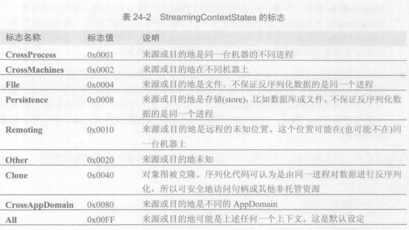

#### 1.序列化
序列化是将对象或对象图转换成字节流的过程。反序列化正好相反。

SerializableAttribute这个定制特性智能应用与引用类型、值类型、枚举类型和委托类型。枚举和委托类型总是可序列化的，所以不用显式应用该特性。SerializableAttribute不会被派生类型继承。
NorSerializedAttribute定制特性指出类型中不应序列化的字段。
```
OnSerializedAttribute
OnDeserializedAttribute
OnSerializingAttribute
OnDeserializingAttribute
```
序列化一组对象时，格式化器首先调用对象标记了OnSerializing特性的所有方法，然后序列化对象的所有字段。最后调用对象标记了OnSerialized特性的所有方法

OptionalFieldAttribute特性，类型中新加的每个字段都要引用该特性，格式化器看到这个特性应用于一个字段时，不会因为流中的数据不包含这个字段而抛出SerializationException

#### 2.格式化器序列化类型实例
为了简化格式化器的操作，FCL在System.Runtime.Serialization命名空间提供了一个FormatterServices类型。该类型只包含静态方法，而且不能被实例化。
序列化
1、格式化器调用FormatterServices的GetSerializableMembers方法：
```
public static MemberInfo[] GetSerializableMembers(Type type, StreammingContext context);
```
该方法利用反射获取类型的public和private实例字段。
2、对象被序列化，MemberInfo对象数组传给FormatterServices的静态方法GetObjectData
```
public static Object[] GetObjectData(Object obj, MemberInfo[] members);
```
3、格式化器将程序集标识和类型的完整名称写入流中
4、格式化器遍历两个数组中的元素，将每个成员的名称和值写入流中

反序列化
1、格式化器中流中读取程序集标识和完整类型名称。如果程序集未加载到AppDomain中就先加载它。如果不能加载抛SerializationException异常，对象不能反序列化。如果已加载，格式化器将程序集标识信息和类型全名传给FormatterServices的静态方法GetTypeFromAssembly
public static Type GetTypeFromAssembly(Assembly assem, String name);
返回Type对象代表反序列化的哪个对象的类型
2、格式化器调用FormatterServices的GetUninitalizedObject方法
```
public static Object GetUnitializedObject(Type type);
```
为一个新对象分配内存，但不调用构造器。所有直接都被初始化为null或0
3、格式化器构造版并初始化一个MemberInfo数组。也是调用前面的GetSerializableMembers方法。这个方法返回序列化好、现在需要反序列化的一组字段
4、格式化器根据流中包含的数据创建并初始化一个Object数组
5、将分配对象、MemberInfo数组以及冰心Object数组（其中包含字段值）的引用传给FormatterServices的PopulateObjectMembers方法
```
public static Object PopulateObjectMembers(Object obj, MemberInfo[] members, Object[] data);
```
这个方法遍历数组，将每个字段初始化为对应的值，至此，对象彻底被反序列化了。

#### 3.控制序列化/反序列化的数据
前面的特性不能提供想要的全部控制。
格式化器内部使用的是反射，反射较慢，为了对序列化/反序列化进行完全的控制，并避免使用反射，可使接口实现System.Runtime.Serialization.ISerializable接口
```
public interface ISerializable {
    void GetObjectData(SerializationInfo info, StreamingContext context);
}
```
其他接口可能调用此方法，并传入损坏的数据，可以给此方法添加一下特性
```
[SecurityPermissionAttribute(SecurityAction.Demand, SerializationFormatter = true)]
```
格式化器序列化对象图会检查每个对象，如果实现了ISerializable接口，就会忽略所有定制特性，改为构造新的System.Runtim.Serialization.SerializationInfo对象

构造SerializationInfo对象时，格式化器要传递两个参数:Type和System.Runtime.Serialization.IFormatterConverter
1. Type参数标识要序列化的对象。唯一性的标识一个类型需要两个部分的信息
   
   * 类型的字符串名称及其程序集标识(包括程序集名、版本、语言文化和公钥)
   * 构造好的SerializationInfo对象包含类型的全名(内部查询Type的FullName),这个字符串会存储到一个私有字段中(如果需要获取类型的全名，可查询SerializationInfo的FullTypeName属性)。类似的，获取类型的定义程序集(通过内部查询Type的Module字段，在查询Module的Assembly属性，再查询Assembly的FullName属性,SerializationInfo的AssemblyName属性)
2. 格式化器调用类型的GetObjectData方法，传递它对SerializationInfo的引用
    GetObjectData方法决定需要哪些信息来序列化对象，并将这些信息添加到SerializationInfo对象中。
    GetObjectData调用SerializaationInfo类型提供的AddValue方法来指定序列化的信息，针对每个数据都要调用一次AddValue

以下代码展示了Dictionary<TKey, TValue>类型如何实现ISerializable和IDeserializationCallback接口来控制其对象的序列化和反序列化
```
[Serializable]
public class Dictionary<TKey, TValue> : ISerializable, IDeserializationCallback
{
    private SerializationInfo m_siInfo; // 只用于反序列化

    // 用于控制反序列化的特殊构造器，这是ISerializable需要的
    [SecurityPermission(SecurityAction.Demand, SerializationFormatter = true)]
    protected Dictionary(SerializationInfo info, StreamingContext context)
    {
        m_siInfo = info;
    }
    // 用于控制序列化的方法
    [SecurityCritical]
    public void GetObjectData(SerializationInfo info, StreamingContext context)
    {
        info.AddValue("Version", m_version);
        info.AddValue("Compare", m_compare, typeof(IEqualityComparer<TKey>));
        info.AddValue("HashSize", (m_buckets == null) ? 0 : m_buckets.Length));
        if (m_buckets != null)
        {
            KeyValuePair<TKey, TValue> array = new KeyValuePair<TKey, TValue>(Count);
            CopyTo(array, 0);
            info.AddValue("KeyValuePair", array, typeof(KeyValuePair<TKey, TValue>));
        }
    }

    // 所有key/value对象按都反序列化后调用方法
    public void OnDeserialization(object sender)
    {
        if (m_siInfo == null) return; // 从不设置，直接返回

        Int32 num = m_siInfo.GetInt32("Version");
        Int32 num2 = m_siInfo.GetInt32("HashSize");
        m_compare = (IEqualityComparer<TKey>)m_siInfo.GetValue("Compare", typeof(IEqualityComparer<TKey>));
        m_buckets = new Int32[num];
        // ...
    }
}

```

注意代码的可访问性与安全性。无论这个特殊构造器是如何声明的，格式化器都能调用。

#### 4.要实现ISerializable但基类未实现

```
[Serializable]
internal class Derived : Base, ISerializable
{
    private DateTime m_date = DateTime.Now;
    public Derived() { /* Make the type instantiable */} // 可实例化

    // 如果这个构造器不存在，便会引发一个SerializationException异常
    [SecurityPermission(SecurityAction.Demand, SerializationFormatter = true)]
    private Derived(SerializationInfo info, StreamingContext context)
    {
        // 为我们的类和基类获取可序列化的成员集合
        Type baseType = this.GetType().BaseType;
        MemberInfo[] mi = FormatterServices.GetSerializableMembers(baseType, context);
        // 从info对象反序列化基类的字段
        for(int i = 0; i < mi.Length; i++)
        {
            // 获取字段，并设置为反序列化的值
            FieldInfo fi = (FieldInfo)mi[i];
            fi.SetValue(this, info.GetValue(baseType.FullName + "+" + fi.Name, fi.FieldType));
        }
        m_date = info.GetDateTime("Date");
    }

    [SecurityPermission(SecurityAction.Demand, SerializationFormatter = true)]
    public virtual void GetObjectData(SerializationInfo info, StreamingContext context)
    {
        // 为这个类序列化希望的值
        info.AddValue("Data", m_date);
        // 获取我们的类和基类的可序列化的成员
        Type baseType = this.GetType().BaseType;
        MemberInfo[] mi = FormatterServices.GetSerializableMembers(baseType, context);
        // 将基类的字段序列化到info对象中
        for(int i = 0; i < mi.Length; i++)
        {
            // 为字段名附加基类全名作为前缀
            info.AddValue(baseType.FullName + "+" + mi[i].Name, ((FieldInfo)mi[i]).GetValue(this));
        }
    }
}
```

#### 5.流上下文
StreamingContext 一个非常简单的值类型
成员:
   
   1. State StreamingContextStates 一组位标志，指定要序列化/反序列化的对象的来源或目的地
   2. Context Object               一个对象引用，对象中包含用户希望的任何上下文信息



IFormatter接口(同时由BinaryFormatter和SoapFormatter类型实现)定义了StreamContext类型的可读写属性Context。构造格式化器时，格式化器会初始化它的Context属性，将State设为All，并将对额外状态对象的引用置为null
格式化器构造好后，就可以使用任何StreammingContextStates为标志来构造一个StreamingContext结构，并可选择传递一个对象引用。在调用格式化器的Serialize或Deserialize方法之前只需要将格式化器的Context属性设为这个新的StreamingContext对象

#### 6.类型序列化为不同对象以及对象反序列化为不同对象
