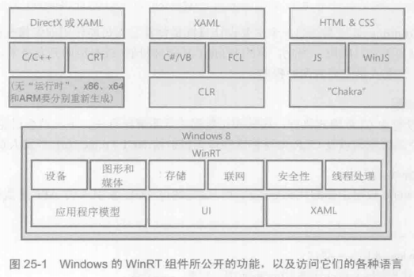
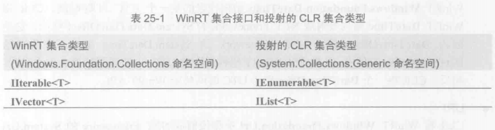
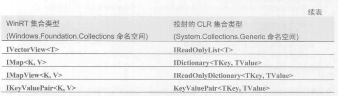
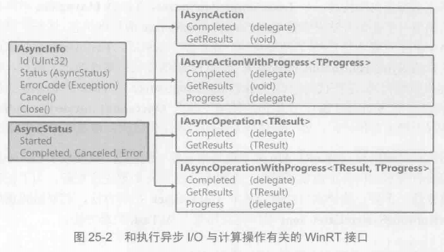

#### 1.WInRT组件
Windows8/8.1带来的新类库，可通过它访问操作系统功能。类库的名称为**Windows运行时**(Windows Runtime, WinRT),其组件通过WinRT类型系统访问

对于原生C/C++实现的应用程序，开发人员必须为每种CPU架构单独编译代码，而.NET只需编译一次(IL)。JavaScript应用程序自带了源代码，“Chakra”虚拟机解析源代码编译成本机代码。


Windows Store应用和桌面阴影程序可通过WinRT组件来利用操作系统的功能。
大多数WinRT组件都只是公开了功能，比如存储、联网、图形、媒体、安全性、线程处理等。而其他核心语言服务（比如字符串操作）和较复杂的框架（比如LINQ）则是由访问WinRT组件的语言提供。

WinRT组件使用由ECMA协会标准化的.NET元数据格式(ECMA-35)来描述其API

CLR通过运行时**可调用包装器(Runtime Callable Wrapper, RCW)**和**COM可调用包装器(COM Callable Wrapper, CCW)**实现了与COM组件的互操作，这使得CLR顶部运行的语言(如C#)能无缝的与WinRT类型和组件进行互操作。

在C#中引用WinRT对象，实际获得是一个RCW的引用，RCW内部引用了WinRT组件。类似的，将一个CLR对象传给WinRT API，实际传递的是一个CCW引用，CCW内部容纳了对CLR对象的引用。

WinRT组件将元数据嵌入扩展名为.winmd的文件中(Windows MetaData)

#### 2.设计目标
1. CLR投射
    CLR投射由CLR隐式执行，通常与元数据的重新解释有关
2. Framework投射
    Framework投射由代码显式执行，通过FCL新引入的API来执行

#### 3.CLR投射与WinRT组件类型系统规则
WinRT组件也遵循自己的类型系统(像CLR一样)。CLR看到一个WinRT类型时，通常允许通过CLR的一般化COM互操作寄宿来使用该类型。但有时候CLR会隐藏WinRT类型(将其动态设为私有)。然后CLR通过一个不同的类型来公开该类型。在内部CLR会通过元数据将这些类型映射成FCL的类型。

**WinRT类型系统的核心概念**
1. 文件名和命名空间
    .winmd文件本身的名称必须和包含WinRT组件的命名空间匹配。例如Wintellect.WindowsStore.winmd文件必须在Wintellect.WindowsStore命名空间或它的子命名空间中定义WinRT组件。(Windows系统不区分大小写)
2. 通用基类型
    WinRT组件不共享一个通用基类。CLR投射一个WinRT类型时，感觉WinRT就像是从System.Object派生。（会继承所有的公共方法）
3. 核心数据类型
    Boolean、无符号字节、16/32/64位有符号和无符号整数、单精度和双精度浮点数、16位字符、字符串和void。和CLR一样，其他所有数据类型都由这些核心数据类型合成。
4. 类
    WinRT是面向对象的类型系统。但有的语言(JavaScript)不支持。所以几乎没有WinRT组件会利用继承和多态。除JavaScript之外语言所用的WinRT组件才会使用继承和多态
5. 结构
    WinRT支持结构(值类型)，他们的实例跨COM互操作边界按值封送。和CLR的值类型不同，WinRT结构只能包括核心数据类型或其他WinRT结构类型的公共字段。WinRT结构不能有构造器或辅助方法。
6. 可控结构
    WinRT API可公开可空结构(值类型).CLR将WinRT的Windows.Foundation.IReference<T>接口投射成System.Nullable<T>类型
7. 枚举
    枚举值作为有符号或无符号32位整数传递。有符号32位枚举被看成是离散值，而无符号32位枚举被看成是可以OR到一起的标志值。
8. 接口
    对于WinRT接口的成员，其参数和返回类型只能是WinRT兼容的类型
9. 方法
    WinRT提供了对方法的有限支持。JavaScript使用动态类型，无法分辨参数类型。WinRT不支持操作符重载方法和默认参数值。实参只能在封送进入或外出(marshal in or out)之间选一个
10. 属性
    WinRT属性的数据类型只能指定WinRT兼容类型。WinRT不支持有参属性或只写属性
11. 委托
    WinRT委托类型只能为参数类型和返回类型指定WinRT组件。向WinRT组件传递一个委托时，委托对象会用一个CCW包装，在使用它的WinRT组件释放CCW之前，该委托对象不会被GC。WinRT委托无BeginInvoke和EndInvoke方法
12. 事件
    WinRT组件可通过一个WinRT委托类型公开事件。由于大多数WinRT组件都密封(无继承)，WinRT定义了一个TypedEventHandler委托
    ```
    public delegate void TypedEventHandler<TSender, TResult>(TSender sender, TResult args);
    ```
    还有一个Windows.Foundation.EventHandler<T>WinRT委托类型，CLR把它投射成System.EventHandler<T>类型
13. 异常
    和COM组件一样，WinRT组件用HRESULT（具有特殊语义的32位整数）值指明状态。
14. 字符串
    可以在WinRT和CLR类型系统之间传递不可变的字符串。但WinRT类型系统不允许字符串为null。(String.Empty)
    字符串以传引用的方式传给WinRT API；传入时被固定(pinned),返回时解除固定(unpinned)。
    将CLR字符串数组传入或传出WinRT API时，会生成包含其所有字符串元素的数组拷贝。传入或返回的是这个拷贝。
15. 日期和时间
    WinRT Windows.Foundation.DateTime结构代表的是一个UTC日期/时间。投射为System.DateTimeOffset结构。
16. URI
    Windows.Foundation.Uri类型投射成System.Uri类型。WinRT只支持绝对URI。URI总是跨越互操作边界拷贝
17. IClosable/IDisposable
    CLR将WinRT Windows.Doundation.IClosable接口(仅有一个Close方法)投射成System.IDisposable接口(及其Dispose方法)。
    **执行I/O操作的所有WinRT API都是异步实现的，所以Close方法不能执行任何I/O操作。**
18. 数组
    WinRT API支持一维零基数组。WinRT能将数组元素封送进入方法，或者从方法封送出去，永远不能两者同时进行。
19. 集合
    向WinRT API传递集合时，CLR用一个CCW来包装对象，然后将CCW引用传给WinRT API。
    
    

#### 4.框架投射
当CLR不能将一个WinRT隐式投射给.NET Framework开发人员时，就需要显示使用框架投射。主要有三种需要框架投射的技术:
1. 异步编程
2. WinRT流
3. .NET Framework流之间互操作以及需要在CLR和WinRt API之间传输数据块的时候



