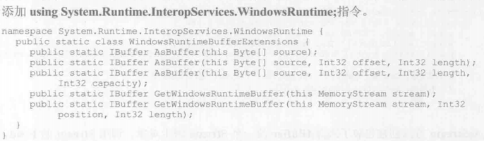

#### 1.WInRT组件
Windows8/8.1带来的新类库，可通过它访问操作系统功能。类库的名称为**Windows运行时**(Windows Runtime, WinRT),其组件通过WinRT类型系统访问

对于原生C/C++实现的应用程序，开发人员必须为每种CPU架构单独编译代码，而.NET只需编译一次(IL)。JavaScript应用程序自带了源代码，“Chakra”虚拟机解析源代码编译成本机代码。


Windows Store应用和桌面阴影程序可通过WinRT组件来利用操作系统的功能。
大多数WinRT组件都只是公开了功能，比如存储、联网、图形、媒体、安全性、线程处理等。而其他核心语言服务（比如字符串操作）和较复杂的框架（比如LINQ）则是由访问WinRT组件的语言提供。

WinRT组件使用由ECMA协会标准化的.NET元数据格式(ECMA-35)来描述其API

CLR通过运行时**可调用包装器(Runtime Callable Wrapper, RCW)**和**COM可调用包装器(COM Callable Wrapper, CCW)**实现了与COM组件的互操作，这使得CLR顶部运行的语言(如C#)能无缝的与WinRT类型和组件进行互操作。

在C#中引用WinRT对象，实际获得是一个RCW的引用，RCW内部引用了WinRT组件。类似的，将一个CLR对象传给WinRT API，实际传递的是一个CCW引用，CCW内部容纳了对CLR对象的引用。

WinRT组件将元数据嵌入扩展名为.winmd的文件中(Windows MetaData)

#### 2.设计目标
1. CLR投射
    CLR投射由CLR隐式执行，通常与元数据的重新解释有关
2. Framework投射
    Framework投射由代码显式执行，通过FCL新引入的API来执行

#### 3.CLR投射与WinRT组件类型系统规则
WinRT组件也遵循自己的类型系统(像CLR一样)。CLR看到一个WinRT类型时，通常允许通过CLR的一般化COM互操作寄宿来使用该类型。但有时候CLR会隐藏WinRT类型(将其动态设为私有)。然后CLR通过一个不同的类型来公开该类型。在内部CLR会通过元数据将这些类型映射成FCL的类型。

**WinRT类型系统的核心概念**
1. 文件名和命名空间
    .winmd文件本身的名称必须和包含WinRT组件的命名空间匹配。例如Wintellect.WindowsStore.winmd文件必须在Wintellect.WindowsStore命名空间或它的子命名空间中定义WinRT组件。(Windows系统不区分大小写)
2. 通用基类型
    WinRT组件不共享一个通用基类。CLR投射一个WinRT类型时，感觉WinRT就像是从System.Object派生。（会继承所有的公共方法）
3. 核心数据类型
    Boolean、无符号字节、16/32/64位有符号和无符号整数、单精度和双精度浮点数、16位字符、字符串和void。和CLR一样，其他所有数据类型都由这些核心数据类型合成。
4. 类
    WinRT是面向对象的类型系统。但有的语言(JavaScript)不支持。所以几乎没有WinRT组件会利用继承和多态。除JavaScript之外语言所用的WinRT组件才会使用继承和多态
5. 结构
    WinRT支持结构(值类型)，他们的实例跨COM互操作边界按值封送。和CLR的值类型不同，WinRT结构只能包括核心数据类型或其他WinRT结构类型的公共字段。WinRT结构不能有构造器或辅助方法。
6. 可控结构
    WinRT API可公开可空结构(值类型).CLR将WinRT的Windows.Foundation.IReference<T>接口投射成System.Nullable<T>类型
7. 枚举
    枚举值作为有符号或无符号32位整数传递。有符号32位枚举被看成是离散值，而无符号32位枚举被看成是可以OR到一起的标志值。
8. 接口
    对于WinRT接口的成员，其参数和返回类型只能是WinRT兼容的类型
9. 方法
    WinRT提供了对方法的有限支持。JavaScript使用动态类型，无法分辨参数类型。WinRT不支持操作符重载方法和默认参数值。实参只能在封送进入或外出(marshal in or out)之间选一个
10. 属性
    WinRT属性的数据类型只能指定WinRT兼容类型。WinRT不支持有参属性或只写属性
11. 委托
    WinRT委托类型只能为参数类型和返回类型指定WinRT组件。向WinRT组件传递一个委托时，委托对象会用一个CCW包装，在使用它的WinRT组件释放CCW之前，该委托对象不会被GC。WinRT委托无BeginInvoke和EndInvoke方法
12. 事件
    WinRT组件可通过一个WinRT委托类型公开事件。由于大多数WinRT组件都密封(无继承)，WinRT定义了一个TypedEventHandler委托
    ```
    public delegate void TypedEventHandler<TSender, TResult>(TSender sender, TResult args);
    ```
    还有一个Windows.Foundation.EventHandler<T>WinRT委托类型，CLR把它投射成System.EventHandler<T>类型
13. 异常
    和COM组件一样，WinRT组件用HRESULT（具有特殊语义的32位整数）值指明状态。
14. 字符串
    可以在WinRT和CLR类型系统之间传递不可变的字符串。但WinRT类型系统不允许字符串为null。(String.Empty)
    字符串以传引用的方式传给WinRT API；传入时被固定(pinned),返回时解除固定(unpinned)。
    将CLR字符串数组传入或传出WinRT API时，会生成包含其所有字符串元素的数组拷贝。传入或返回的是这个拷贝。
15. 日期和时间
    WinRT Windows.Foundation.DateTime结构代表的是一个UTC日期/时间。投射为System.DateTimeOffset结构。
16. URI
    Windows.Foundation.Uri类型投射成System.Uri类型。WinRT只支持绝对URI。URI总是跨越互操作边界拷贝
17. IClosable/IDisposable
    CLR将WinRT Windows.Doundation.IClosable接口(仅有一个Close方法)投射成System.IDisposable接口(及其Dispose方法)。
    **执行I/O操作的所有WinRT API都是异步实现的，所以Close方法不能执行任何I/O操作。**
18. 数组
    WinRT API支持一维零基数组。WinRT能将数组元素封送进入方法，或者从方法封送出去，永远不能两者同时进行。
19. 集合
    向WinRT API传递集合时，CLR用一个CCW来包装对象，然后将CCW引用传给WinRT API。
    
    

#### 4.框架投射
当CLR不能将一个WinRT隐式投射给.NET Framework开发人员时，就需要显示使用框架投射。主要有三种需要框架投射的技术:
1. 异步编程
2. WinRT流
3. .NET Framework流之间互操作以及需要在CLR和WinRt API之间传输数据块的时候

#### 5.异步编程


#### 6.WinRT流
许多.NET Framework类要求操作System.IO.Stream派生类型，包括序列化和LINQ to xml等。只有使用System.IO.WindowsRuntimeStorageExtensions类定义的扩展方法，实现了WinRT IStorageFile或IStorageFolder接口的WinRT对象才能和要求Stream派生类型的.NET Framework类一起使用


将WinRT流接口转型为.NET Framework的Stream类型


.NET Framework提供的"转型"扩展方法不仅仅是执行转型。
将WinRT流转换成.NET Framework流时，会在托管堆中为WinRT流隐式创建一个缓冲区，结果是大多数操作都向这个缓冲区写入，不需要跨越操作边界，提升了性能。

使用.NET Framework流投射的好处，在同一个WinRT流实例上多次执行一个AsStreamXxx方法，不会创建多个互相没有连接的缓冲区，造成向一个缓冲区写入的数据在另一个那里看不到。.NET Framework的API确保每个流对象都有唯一的适配器实例，所有用户共享一个缓冲区。

可通过AsStreamXxx的重载设置缓冲区大小(默认16kb，设置为0就不会创建缓冲区，降低网络延迟之类的)
#### 7.在CLR和WinRT之间传输数据块
要尽量使用之前的框架投射，因为他们的性能不错。
有时需要在CLR和WinRT组件之间传递原始数据块(raw blocks)。例如WinRT的文件和套接字流组就要求读写原始数据块。另外WinRT的加密组件要对数据块进行加密和解密，位图像素也要用原始数据块来维护。
.Net Framework获取数据块的方式一般是通过字节数组(Byte[]),或者通过流(MemoryStream)。字节数组和流都不能直接传给WinRT组件。所以WinRT定义了IBuffer接口，实现了该接口的对象代表可传给WinRT API的原始数据块。

```
namespace Windows.Storage.Streams {
    public interface IBuffer {
        UInt32 Capacity { get; }
        UInt32 Length { get; set; }
    }
}
```
WinRT没有提供在缓冲区中读写数据的方式，主要由于WinRT类型不能再其元数据中表示指针，因为指针不能很好地映射到部分语言(JavaScript和安全C#代码)。所以IBuffer对象实际只是CLR和WinRT API之间传递内存地址的一种方式。

为了访问内存地址处的直接，需要使用一个名为IBufferByteAccess的内部**COM接口**
```
namespace System.Runtime.InteropServices.WindowsRuntime {
    [Guid("9...")]
    [InterfaceType(ComInterfaceType.InterfaceIsUnknown)]
    [ComImport]
    internal interface IBufferByteAccess {
        unsafe Byte* Buffer { get; }
    }
}
```
CLR内部获取IBuffer对象，查询IBufferByteAccess接口，在查询Buffer属性来获取向缓冲区中的字节数据的不安全指针

FCL包含了一个WindowsRuntimeBufferExtensions类，可调用这些方法在CLR字节数组和传给WinRT IBuffer对象的流之间传递数据块


将一个Byte[]传给需要一个IBuffer的WinRT API，只需在Byte\[\]数组上调用AsBuffer。实际上是将对Byte\[\]的引用包装到实现了IBuffer接口的对象中，数组内容不会被复制。
类似的


在代码中调用AsBuffer或GetWindowsRuntimeBuffer扩展方法时，这些方法将来源对象包装到实现了IBuffer接口的一个类的对象中。然后CLR为该对象创建一个CCW，并将CCW传递给WinRT API。一旦WinRT获取指针，字节数组就会被固定。一旦调用COM的Release方法，字节数组就会解除固定。

调用一个IBuffer的WinRT API时，数据可能在本机(native)内存中，需要以某种方式从托管代码中访问这些数据。

AsStream方法创建包装了来源IBuffer的一个Stream派生对象。ToArray方法在内部分配一个Byte\[\]，将来源IBuffer中的字节复制到Byte\[\]中

以下代码演示了如何用C#实现各种WinRT组件，用C#实现WinRT组件时，建议把它作为模板使用
```
using System;
using System.Collections.Generic;
using System.Linq;
using System.Runtime.InteropServices.WindowsRuntime;
using System.Threading;
using System.Threading.Tasks;
using Windows.Foundation;
using Windows.Foundation.Metadata;

// The namespace MUST match the assembly name and cannot be "Windows"
namespace Wintellect.WinRTComponents
{
    // [Flag] // Must not be present if enum is int; required if enum is uint
    public enum WinRTEnum : int // Enums must be backed by int or uint
    {
        None,
        NotNone,
    }

    //Structures can only contain core data types, String & other structures
    // No constructors or methods are allowed
    public struct WinRTStruct
    {
        public Int32 ANumber;
        public String AStrng;
        public WinRTEnum AEnum; // Really just a 32-bit integer
    }

    // Delegate mush have WinRT-compatible types in the signature (no BeginInvoke/EndInvoke)
    public delegate String WinRTDelegate(Int32 x);

    // Interfaces can have methods, properties, events  but cannot be generic
    public interface IWinRTInterface
    {
        // Nullable<T> marshals as IReference<T>
        Int32? InterfaceProperty { get; set; }
    }

    // Members without a [Version(#)] attribute default to the class's
    // version(1) and are part of the same underlying COM interface
    // produced by WinMPExp.exe
    [Version(1)]
    // class must be derived from Object, sealed, not generic,
    // implement only WinRT interfaces, public members must be WinRT types
    public sealed class WinRTClass : IWinRTInterface
    {
        // public fields are not allowed

        #region class can expose static methods, properties, and events
        public static String StaticMethod(String s) { return "Returning" + s; }
        public static WinRTStruct StaticProperties { get; set; }


        // In JavaScript 'out' parameters are retuend as objects with each 
        // parameter becoming property along with the return value
        public static String OutParameters(out WinRTStruct x, out Int32 year)
        {
            x = new WinRTStruct() { AEnum = WinRTEnum.None, ANumber = 333, AStrng = "hello" };
            year = DateTime.Now.Year;
            return "2333";
        }
        #endregion

        // Constructor can take arguments but not out/ref arguments
        public WinRTClass(Int32? number)
        {
            InterfaceProperty = number;
        }
        public int? InterfaceProperty { get; set; }

        // Only ToString is allowed to be overridden
        public override string ToString()
        {
            return "ToString";
        }

        public void ThrowingMethod()
        {
            throw new InvalidOperationException("My exception msg");
            // To throw a specific HRESULT, use COMException instead
            // const Int32 COR_E_INVALIDOPERATION = unckecked((Int32)0x80131509);
            // throw new COMException("Invalid Operation", COR_E_INVALIDOPERATION);
        }

        #region Arrays are passed ,returned OR filled; never a combination
        public Int32 PassArray([ReadOnlyArray] /* [In] implied */ Int32[] data)
        {
            // Note: Modified array contents MAY not be marshaled out; do not modify the array
            return data.Sum();
        }

        public Int32 FillArray([WriteOnlyArray] /* [Out] implied */ Int32[] data)
        {
            // NOTE: Original array contents MAY not be marshaled in;
            // write to the array before reading from it
            for (Int32 n = 0; n < data.Length; n++) data[n] = n;
            return data.Length;
        }

        public Int32[] ReturnArray()
        {
            // Array is marshaled out upon return
            return new int[] { 1, 2, 3 };
        }

        #endregion

        // Cloections are passed by reference
        public void PassAndModifyCollection(IDictionary<String, object> collection)
        {
            collection["Key2"] = "Value2"; // Modify collection in place via interop
        }

        #region Method overloading
        // Overload with same # of parameters are considered identical to JavaScript
        public void SomeMethod(Int32 x) { }
        [Windows.Foundation.Metadata.DefaultOverload] // Attribute makes this method the default overload
        public void SomeMethod(String s) { }
        #endregion

        #region Automatically implemented event
        public event WinRTDelegate AutoEvent;

        public String RaiseAutoEvent(Int32 number)
        {
            WinRTDelegate d = AutoEvent;
            return (d == null) ? "No callbacks registered" : d(number);
        }
        #endregion

        #region Manually implementd event
        // private field that keeps track of the event's registered delegates
        private EventRegistrationTokenTable<WinRTDelegate> m_manulEvent = null;

        // Manual iimplementation of the event's add and remove methods
        public event WinRTDelegate ManualEvent
        {
            add
            {
                // Gets the existing table, or creates a new one if the table is not ye initialized
                EventRegistrationTokenTable<WinRTDelegate>.GetOrCreateEventRegistrationTokenTable(ref m_manulEvent).AddEventHandler(value);
            }
            remove
            {
                EventRegistrationTokenTable<WinRTDelegate>.GetOrCreateEventRegistrationTokenTable(ref m_manulEvent).RemoveEventHandler(value);
            }
        }

        public String RaiseManualEvent(Int32 number)
        {
            WinRTDelegate d = EventRegistrationTokenTable<WinRTDelegate>.GetOrCreateEventRegistrationTokenTable(ref m_manulEvent).InvocationList;
            return (d == null) ? "No callback registered" : d(number);
        }
        #endregion

        #region Asynchronous methods
        // Async methods MUST return IAsync[Action|Operation](WithProcess)
        // NOTE: other languages see the DataTimeOffset as Windows.Foundation.DateTime
        public IAsyncOperationWithProgress<DateTimeOffset, Int32> DoSomethingAsync()
        {
            // Use the System.Runtime.InteropServices.WindowsRuntime.AsyncInfo's Run methods to 
            // invoke a private method writter entirely in managed code
            return AsyncInfo.Run<DateTimeOffset, Int32>(DoSomethingAsyncInternal);
        }

        // Implement the async operation via a private method using normal .NET technologies
        private async Task<DateTimeOffset> DoSomethingAsyncInternal(CancellationToken ct, IProgress<Int32> progress)
        {
            for(Int32 x = 0; x < 10; x++)
            {
                ct.ThrowIfCancellationRequested();
                if (progress != null) progress.Report(x * 10);
                await Task.Delay(1000);
            }
            return DateTime.Now;
        }

        public IAsyncOperation<DateTimeOffset> DoSomethingAsync2()
        {
            // If you don't need cancellation  & progress, use
            // System.WIndowsRUntimeSystemExtensions's AsAsync[Action|Operation] Task
            // extension methods (these call AsyncInfo.Run internally)
            return DoSomethingAsyncInternal(default(CancellationToken), null).AsAsyncOperation();
        }

        #endregion

        // After you ship a version, mark new members with a [Version(#)] attribute
        // so that WinMDExp.exe puts the new members in a fifferent underlying COM
        // interface. this is required since COM interfaces are supposed to be immutable.
        [Version(2)]
        public void NewMethodAddedInV2() { }
    }
}


```
一下JavaScript代码演示了如何访问前面所有WinRT组件和功能
```
function() {
    //Make accessing the namespace more convenient in the code
    var WinRTComps = Winteleect.WinRTComponents;
    
    // NOTE: the javascript VM projects WinRT APIs via camel casing

    // Access WinRT type's static method & property
    var s = WinRTComps.WinRTClass.staticMethod(null); Note:JavaScript pass "null" here
    var struct = { anumber:123, astring:"hellp", aenum:WinRTComps.WinRTEnum.notNone};
    WinRTComps.WinRTClass.staticProperty; // Read it back

    // If the method has out parameters, they and the return value
    // are returned as an object's properties
    var s = WinRTComps.WinRTClass.outParameters();
    var name = s.value // Return value
    var struct = s.x; // an 'out' parameter
    var year = s.year; // another 'out' parameter
    
    // Construct an instance of the WinRT compnent
    var winRTClass = new WinRTComps.WinRTClass(null);
    s = winRTClass.toString(); // call ToString()

    // Demonstrate throw and catch
    try  { winRTClass.throwingMethod(); }
    catch(err) { }

    // Array passing
    var a = {1, 2, 3, 4, 5}
    var sum = winRTClass.passArray(a);

    // Array filling
    var arrayOut = [7, 7, 7]; // Note: fillArray sees all zeros!
    var length = winRTClass.fillArray(arrayOut);// On return, arrayOut = [0, 1, 2]

    // Array returning
    a = winRTClass.returnArray(); // a = [1, 2, 3]

    // Pass a collection and have its elements modified
    var localSettings = Windows.Storage.ApplicationData.current.localSettings;
    localSettings.values["Key1"] = "Value1";
    winRTClass.passAndModifyCollection(localSettings.values);
    // On return, localSettings.values has 2key/value pair in it

    // Call overloaded method
    winRTClass.someMethod(5); // Actually calls SomeMethod(String) passing "5"

    // Comsume the automatically implemented event
    var f = function(v) { return v.target; }
    winRTClass.addEventListener("autoevent", f, false);
    s = winRTClass.raiseAutoEvent(7);

    // Consume the manually implemented event
    winRTClass.addEventListener("manualevent", f, false);
    s = winRTClass.raiseManualEvent(8);

    // Invoke asyncronous method supporting progress, cancelation, & error handing
    var promise = winRTClass.doSomethingAsync();
    promise.then(
        function (result) {...}
        function (error) {...}
        function (progress) {
            ...
        }
    )
}
```