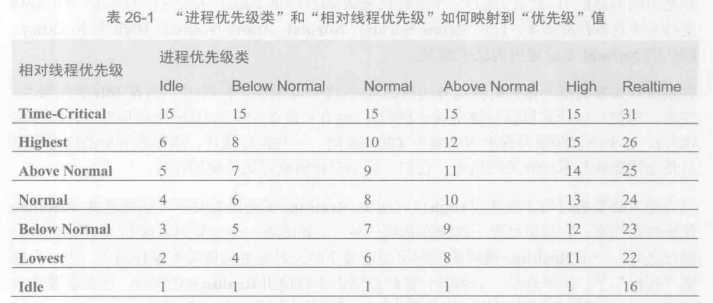

#### 1.进程(Process)
各种资源的容器，定义了一个地址空间作为基本的执行环境
#### 2.Windows为什么要支持线程
单核CPU应用程序发生死循环时，不能执行其他任何东西。
Windows为每个进程都提供了该进程专用的线程(功能相当于一个CPU)。
#### 3.线程开销
每个线程有以下要素
**1. 线程内核对象(thread kernel object)**
    OS为系统中创建的每个线程都分配并初始化这种数据结构之一。数据结构包含一组对线程进行描述的属性。还包括所谓的线程上下文。上下文是包含CPU寄存器集合的内存块
**2. 线程环境块(thread environment block, TEB)**
    TEB是用户模式(应用程序代码能快速访问的地址空间)中分配和初始化的内存块。TEB耗用一个内存页(x86,x64和ARM中是4kb)。TEB包含线程的异常处理链首(head)。线程进入的每个try块都在链首插入一个节点；线程退出时删除。此外，TEB还包括线程的“线程本地存储”数据，以及由GDI(Graphics Device Interface)和OpenGL图形使用的一些数据结构
**3. 用户模式栈(user-mode stack)**
    用户模式栈存储传递给方法的局部变量和实参。还包括一个地址:指向当前方法返回时，线程应该从什么地方接着自信。Windows默认为每个进程的用户模式栈分配1MB内存。(实际需要时才会提交)
**4. 内核模式栈(kernel-mode stack)**
    向OS的类和模式函数传递实参时使用。为了安全，从用户模式的代码传给内核的任何实参，Windows都会把他们从线程的用户模式栈复制到线程的内核模式栈。应用程序不能访问类和模式栈。除此之外内核会调用自己内部的方法，并利用内核模式栈传递它自己的实参、存储函数的局部变量以及存储返回地址。
**5. DLL线程连接(attach)和线程分离(detach)通知**
    Windows中的一个策略，任何时候在进程中创建线程都回调用进程中加载的所有非托管DLL的DllMain方法，并向方法传递DLL_THREAD_ATTACH标志;DLL_THREAD_DETACH标志。

程序加载DLL越多，越影响在进程中创建和销毁线程的性能(C#和大多数途观编程语言生成的DLL没有DllMain函数，因此不会受到通知，提升了性能。非托管DLL可调用win32 DisableThreadLibraryCalls函数来决定不理会这些通知)

单CPU一次只能做一件事情，Windows必须在系统中的所有线程(逻辑CPU)之间共享物理CPU

Windows任何时刻只将一个线程分配给CPU。运行一个“时间片”。到期后就上下文切换到另一个线程。每次切换都要求Windows执行以下操作
1. 将CPU寄存器的值保存到当前正在运行的线程的内核对象内部的一个上下文结构中
2. 从现有线程集合选出一个线程供调度。如果该线程由另一个进程拥有，Windows在开始执行任何代码或者解除任何数据时，还必须切换CPU“看见”的虚拟地址空间
3. 将所选上下文结构中的值加载到CPU的寄存器中

要构建高性能应用程序和组件，就应该尽量避免上下文切换。

GC时，CLR必须挂起所有线程，减少线程也能提高GC的性能。调试器遇到断点时，Windows都会挂起正在调试的应用程序中的所有线程，并在单步执行或者运行应用程序时恢复所有线程。

尽量避免使用线程，它们要好用大量内存，而且相当多的时间来创建、销毁和管理。
有时候必须使用线程，它们使Windows变得更健壮，响应更灵敏。

Windows确保单个线程不会同时在多个内核上调度。

#### 4."以一种智能的方式"使用线程
1. 多个CPU
2. 超线程芯片
    允许一个芯片在OS中显示成2个。芯片中包含两组架构状态(比如CPU寄存器)，但芯片只有一组执行资源。
3. 多核芯片

#### 5.CLR线程和Windows线程
CLR线程完全等价于Windows线程

整个System.Thread类都不开放给Windows Store

#### 6.使用专用线程执行异步的计算限制操作
避免使用~Windows Stror中Thread类不可用

满足以下任何条件，就可显示创建自己的线程
1. 线程需要以非普通线程优先级运行。默所有线程池线程都以普通优先级运行
2. 需要线程表现为一个前台线程，防止应用程序在线程结束任务前终止
3. 计算限制的任务需要长时间运行
4. 要启动线程，并可能调用Thread的Abort方法来提前终止它

以下是Thread的构造器原型
```
public sealed class Thread : CriticalFinalizerObject, ... {
    public Thread(ParameterizedThreadStart start);
    ...
}
```
ParameterizedThreadStart委托
```
delegate void ParameterizedThreadStart(Object obj);
```
构造Thread对象是轻量级的操作，并不创建一个操作系统线程。调用Thread的Start方法，向它传递要作为回调方法的实参传递的对象(状态)

#### 7. 使用线程的理由
1. 可响应性(通常是对于客户端GUI应用程序)
2. 性能(对于客户端和服务器应用程序)
    由于Windows每个CPU调度一个线程，多个CPU可并发(只有多DPU才能得到性能的提升)

#### 8.线程调度和优先级
Windows被称为抢占式多线程操作系统，并不能保证自己的线程一直运行。
线程优先级0-31
较高优先级的线程总是抢占较低优先级的线程。

**零页线程**(zero page thread)。优先级为0(系统唯一)，在没其他线程需要“干活时”，零页线程将系统RAM的所有空闲页清零。

**优先级类**(priority class)
Idle、Below Normal、Normal(默认)、Above Normal、High和Realtime
Idle适合系统什么事情都不做的时候运行(比如屏保)
只有绝对必要的时候才应使用High优先级类。
Realtime尽可能避免，可能干扰操作系统任务。通常用于响应延迟很短的硬件事件或者执行一些不能中断的任务。


不存在与上表的线程保留给零页线程或以内核模式运行的设备驱动程序了，用户模式的应用程序不能。

Windows永远不会调度进程，只调度线程。“进程优先级类”是Microsoft提出的抽象概念。

最好是降低一个线程的优先级而不是提升另一个线程的优先级

#### 9.前台线程和后台线程
一个进程的所有前台进程停止运行时，CLR强制终止仍在运行的任何后台线程。这些后台进程被直接终止:不抛出异常

主线程以及通过构造一个Thread对象来显式创建的任何线程默认都是前台线程
线程池则默认是后台线程，由进入托管执行环境的本机代码创建的任何线程也被标记为后台线程


