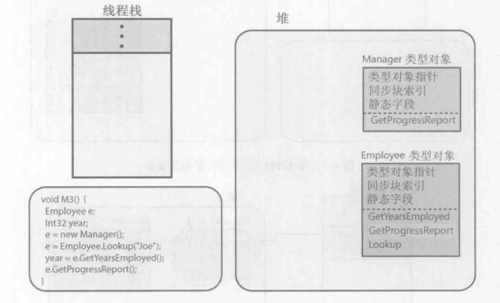
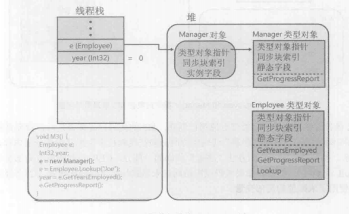
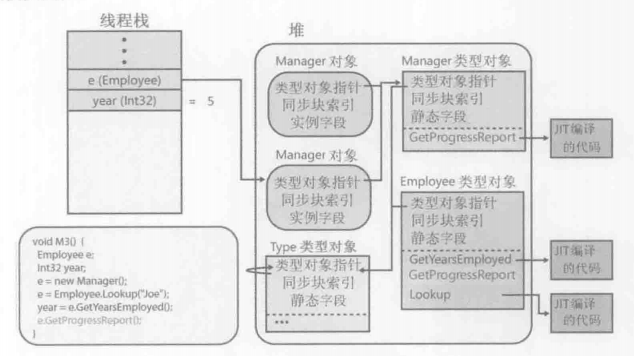

#####1.CLR要求所有对象都用new操作符创建，以下是new操作符所做的事情
   
1. 计算类型及其所有基类型中定义的所有实例字段所需要的字节数。堆上每个对象都需要一些额外的成员，包括“类型对象指针”和“同步块索引”。CLR利用这些成员管理对象。额外成员的字节数要记入对象大小。
2. 从托管堆中分配类型要求的字节数，从而分配对象的内存，分配的所有字节都设成0。
3. 初始化对象的“类型对象指针”和“同步块索引”成员。
4. 调用类型的构造器。
new执行了所有这些操作后，返回新建对象的一个引用（或指针）。
没有与new操作符对应的delete操作符，使用的是垃圾回收机制。

#####2.使用C#的is和as操作符来转型
is检查对象是否兼容于指定类型，返回Boolean，is操作符永不抛出异常，如果对象引用null，操作符返回false,因为没可检查其类型的对象。
```
if (o is Employee)
Employee e = (Employee) o;
```
上述代码会检查两次对象类型，所以提供了as操作符，简化代码写法和提升性能，as操作符永不抛出异常。
```
Employee e = o as Employee;
if (e != null)
//do something
```
#####3.c#using指令的另一种形式允许为类型或者命名空间创建别名。
```
using WintellectWidget = Wintellect.Widget;
WintellectWidget widget = new WintellectWidget();
```
#####4.相同命名空间的类型可能在不同的程序集中实现。

#####5.运行时的相互关系
JIT编译器将IL代码转换成本机CPU指令时，会确认IL代码内部引用的所有类型的所有程序集已经加载，然后利用程序集的元数据，CLR提取与这些类型有关的信息创建一些数据结构来表示类型本身。


当CLr确认方法需要的所有类型对象都已创建，M3的代码已经编译之后，就允许线程执行M3的本机代码。代码执行前必须在线程栈中为局部变量分配内存并自动将局部变量初始化为null或0。

调用虚实例方法时，JIT编译器要在方法中生成一些额外代码:方法每次调用都会执行这些代码，这些代码首先检查发出调用的变量，并跟随地址来到发出调用的对象，然后代码检查对象内部的“类型对象指针”成员，该成员指向对象的实际类型。

#####6.类型对象本质上也是对象
CLR开始在一个进程中运行时，会立即为MSCorLib.dll中定义的System.Type类型创建一个特殊的类型对象。
System.Type类型对象本身也是对象，“类型对象指针”指向它自己。

