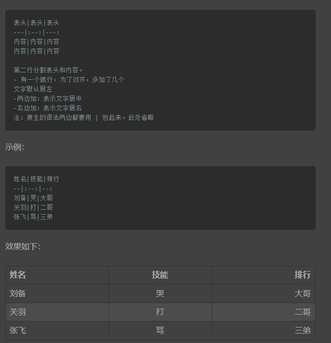

## 一、标题
在想要设置为标题的文字前面加#表示
# 这是个一级标题
## 这是个二级标题

## 二、字体
* 加粗
**要加粗的文字左右分别用两个\*包起来**
* 斜体
*要斜体的文字左右分别用一个个\*包起来*
* 斜体加粗
***要倾斜体的文字左右分别用三个\*包起来***
* 删除线
~~要加删除线的文字左右用两个\~号包起来~~

## 三、引用
在引用前加\>即可。引用可以嵌套
示例:
>这是引用的内容
>>这是引用的内容
>>>这是引用的内容

## 四、分割线
三个或者三个以上的-或者*都可以
***
-----

## 五、图片
\!\[图片alt]\(图片地址 "图片地址")
图片alt就是显示在图片下的文字
图片title是图片的标题，为鼠标移到上面显示的内容。title可加可不加


## 六、超链接
\[超链接名]\(超链接地址 "超链接title")
[百度](https://www.baidu.com "hah")

也可以用html的a标签代替
\<a href="超链接地址" target="_blank">超链接名</a>
<a href="https://www.baidu.com" target="_blank">超链接名</a>

## 七、列表
* **无序列表**
无序列表用-+*任何一种都可以，与内容之间要有一个空格
* 列表内容
+ 列表内容
- 列表内容

* **有序列表**
数字加点，星号与内容之间要有空格
1. 列表内容
2. 列表内容
3. 列表内容
4. 列表内容

* **列表嵌套**
上一级和下一级之间敲三个空格即可
* 一级无序列表集合
   
   1. 二级
   2. 二级
* 一级
   
   * 二级
   * 二级

## 八、表格
语法:


## 九、代码
单行代码：代码之间分别用一个反应好包起来
\`代码内容\`
`function`

代码块
```
    function func()
        return 1
    end
```


